# UEvent ERD Final

## 1) Phạm vi chốt cuối
ERD Final này là bản chốt để đi vào triển khai backend MVP, dựa trên:
- Mô tả nghiệp vụ trong [Docs/details.txt](Docs/details.txt)
- Luồng nghiệp vụ trong [Docs/sequence](Docs/sequence)
- Quyết định đã trả lời trong [Docs/ERD_final_questions.md](Docs/ERD_final_questions.md)

### 1.1 Phạm vi MVP (đã chốt)
1. Identity và Access
2. Event Lifecycle
3. Registration và Ticketing
4. Check-in QR (có chống giả mạo và chống race condition)
5. Q&A và Feedback
6. Notification
7. Moderation (Audit logs tách ra OpenSearch/ELK)
8. Support module

### 1.2 Ngoài MVP
1. Payments (để abstract)
2. Các mở rộng analytics nâng cao theo thiết bị

---

## 2) Quyết định thiết kế đã khóa
1. User đa vai trò qua `roles` và `user_roles`.
2. Mỗi user chỉ có đúng 1 role chính (`is_primary=true`).
3. Support module thuộc MVP.
4. `events.status` có thêm `archived`.
5. Toàn hệ thống lưu thời gian bằng UTC; chỉ convert khi hiển thị.
6. `cancellation_deadline_at` lưu tĩnh theo từng event.
7. Có danh sách chờ khi full (`waitlisted`).
8. `event_registrations.status` có `checked_in`.
9. Form answers lưu ở JSONB, chưa cần `schema_version` trong MVP.
10. Cho phép sửa form answers có kiểm soát; khóa sau khi phát hành vé.
11. QR cần chữ ký số/checksum, hỗ trợ mã QR xoay vòng 15 giây.
12. Ticket hết hạn theo `events.end_at`.
13. Check-in bắt buộc cơ chế transaction lock.
14. Mỗi user chỉ gửi 1 feedback cho 1 event.
15. Feedback dùng `is_anonymous` (không thêm `visibility`).
16. Questions có moderation status: `visible`, `hidden`, `flagged`.
17. Notifications có `template_id` nullable để mở rộng.
18. `notification_recipients.read_at` không bắt buộc cho MVP.
19. Moderation action có thêm `reopen`, `escalate`.
20. `audit_logs` không lưu trong database — tách ra OpenSearch/ELK stack cho khả năng mở rộng.
21. `events.created_by` giữ `RESTRICT` vì chính sách soft delete, không xóa cứng.
22. `event_questions.user_id` và `event_feedbacks.user_id` dùng `SET NULL` để giữ lịch sử khi có xóa cứng ngoại lệ.
23. Địa điểm tách thành `campuses`, `buildings`, `rooms`.
24. Chuẩn hóa cột thời gian: `created_at`, `updated_at`, `deleted_at`.
25. Chốt ma trận index theo truy vấn API chính.
26. `checkin_logs.ticket_id` nullable để cho phép log quét QR sai format (không tìm được ticket).
27. `event_invitations.inviter_user_id` nullable để tương thích FK policy `SET NULL`.
28. `user_auth_identities` có `UNIQUE(provider, provider_subject)` chống liên kết trùng.
29. `users.student_code` có partial unique (unique khi NOT NULL) chống trùng MSSV.
30. `events.max_capacity` nullable — NULL = không giới hạn sức chứa; CHECK >= 1.
31. `notifications.event_id` nullable FK — liên kết notification với event liên quan.
32. `event_feedbacks.rating` có CHECK(1-5) ở DB level.
33. `user_sessions.fcm_token` nullable — lưu FCM device token cho push notification.
34. Thêm bảng `app_settings` cho quản lý cấu hình ứng dụng (BFD 6.3).

---

## 3) Bảng mô tả các bảng trong database

### 3.1 Module Identity & Access

| Bảng | Mô tả | Dữ liệu mẫu |
|---|---|---|
| **users** | Lưu thông tin người dùng (sinh viên, BTC, admin) | student@utc2.edu.vn, Nguyễn Văn A, 2024001 |
| **roles** | Danh mục vai trò trong hệ thống | student, organizer, admin |
| **user_roles** | Mapping nhiều-nhiều giữa user và role, có 1 primary role | user_123 → student (primary), user_123 → organizer |
| **user_auth_identities** | Phương thức xác thực của user (Google, email, passkey) | Google OAuth, email + password, passkey |
| **user_sessions** | Phiên đăng nhập của user, quản lý refresh token | session_abc, expires 7 ngày, device: iPhone 14 |

### 3.2 Module Location

| Bảng | Mô tả | Dữ liệu mẫu |
|---|---|---|
| **campuses** | Cơ sở/campus của trường (UTC2 có thể mở rộng nhiều cơ sở) | UTC2 - Cơ sở chính |
| **buildings** | Tòa nhà trong campus | Nhà A, Nhà B, Nhà Thực hành |
| **rooms** | Phòng/hội trường trong tòa nhà | A101, Hội trường C, Sân vận động |

### 3.3 Module Event Core

| Bảng | Mô tả | Dữ liệu mẫu |
|---|---|---|
| **event_categories** | Danh mục sự kiện (Âm nhạc, Học thuật, Thể thao...) | Âm nhạc, Học thuật, Tình nguyện, Workshop |
| **events** | Thông tin chi tiết sự kiện | UEvent Launch Party, 20/04/2026, A101, 200 chỗ |
| **event_organizers** | Ban tổ chức của sự kiện, phân quyền owner/co_host/staff/checkin | user_123 → owner, user_456 → staff |
| **registration_form_fields** | Định nghĩa form đăng ký tùy chỉnh cho từng sự kiện | Size áo (S/M/L/XL), Buổi tham gia (Sáng/Chiều) |
| **event_invitations** | Lời mời tham gia sự kiện qua email/contact/link | Mời abc@utc2.edu.vn, gửi lúc 15/04 10:00 |

### 3.4 Module Registration & Ticketing

| Bảng | Mô tả | Dữ liệu mẫu |
|---|---|---|
| **event_registrations** | Đăng ký tham gia sự kiện của user | user_789 đăng ký event_123, trạng thái: registered |
| **registration_cancellation_requests** | Yêu cầu hủy đăng ký, cần BTC duyệt | user_789 xin hủy vì bận việc gia đình |
| **tickets** | Vé điện tử phát hành sau khi đăng ký thành công | Ticket TK2024001, QR payload + signature |
| **ticket_qr_tokens** | Token QR xoay vòng 15 giây để chống chụp lại | token_abc valid từ 10:00:00 đến 10:00:15 |
| **checkin_logs** | Lịch sử check-in, ghi cả thành công và thất bại | 10:05:32 - success, scanner: user_admin |

### 3.5 Module Interaction

| Bảng | Mô tả | Dữ liệu mẫu |
|---|---|---|
| **event_questions** | Câu hỏi của người tham gia dành cho BTC | "Sự kiện có gửi áo miễn phí không?" |
| **event_feedbacks** | Đánh giá của người tham gia sau sự kiện | Rating 5*, "Sự kiện rất hay, BTC nhiệt tình" |

### 3.6 Module Notification

| Bảng | Mô tả | Dữ liệu mẫu |
|---|---|---|
| **notification_templates** | Mẫu thông báo có thể tái sử dụng | EVENT_REMINDER: "Sự kiện {{event}} sẽ diễn ra vào {{time}}" |
| **notifications** | Thông báo được tạo (từ template hoặc tùy chỉnh) | "UEvent Launch Party bắt đầu trong 1 giờ nữa" |
| **notification_recipients** | Người nhận từng thông báo, track trạng thái đã đọc | user_123: sent, user_456: read |

### 3.7 Module Moderation

| Bảng | Mô tả | Dữ liệu mẫu |
|---|---|---|
| **event_moderation_logs** | Lịch sử kiểm duyệt sự kiện bởi admin | Admin duyệt event_123 lúc 10:00, action: approve |

> **Ghi chú**: Audit logs (nhật ký hệ thống) được tách ra **OpenSearch/ELK stack** thay vì lưu trong database.

### 3.8 Module Support

| Bảng | Mô tả | Dữ liệu mẫu |
|---|---|---|
| **support_tickets** | Yêu cầu hỗ trợ từ người dùng | "Không thể đăng ký sự kiện", category: technical |
| **support_messages** | Tin nhắn trao đổi trong ticket hỗ trợ | User: "Tôi bị lỗi...", Staff: "Vui lòng thử lại" |

### 3.9 Module Admin Config

| Bảng | Mô tả | Dữ liệu mẫu |
|---|---|---|
| **app_settings** | Cấu hình chung của ứng dụng do admin quản lý | max_events_per_user: 10, maintenance_mode: false |

---

## 4) Bảng mô tả mối quan hệ giữa các bảng

### 4.1 Quan hệ Identity & Access

| Quan hệ | Loại | Mô tả | Ràng buộc phụ |
|---|---|---|---|
| users → user_auth_identities | 1-N | Một user có nhiều phương thức xác thực (Google + Email + Passkey) | Cascade khi xóa user |
| users → user_sessions | 1-N | Một user có nhiều session (tối đa 5 active) | Cascade khi xóa user |
| users ← user_roles → roles | N-N | User có nhiều role, nhưng chỉ 1 primary role | Unique (user_id, role_id) |

### 4.2 Quan hệ Location

| Quan hệ | Loại | Mô tả | Ràng buộc phụ |
|---|---|---|---|
| campuses → buildings | 1-N | Một campus có nhiều building | Restrict khi xóa campus |
| buildings → rooms | 1-N | Một building có nhiều room | Restrict khi xóa building |
| rooms → events | 1-N | Một room tổ chức nhiều event | Set NULL khi room bị vô hiệu hóa |

### 4.3 Quan hệ Event Core

| Quan hệ | Loại | Mô tả | Ràng buộc phụ |
|---|---|---|---|
| event_categories → events | 1-N | Một category có nhiều event | Restrict khi xóa category |
| users → events | 1-N | Một user tạo nhiều event (created_by) | Restrict (không xóa cứng user) |
| events ← event_organizers → users | N-N | Event có nhiều BTC, user tham gia BTC nhiều event | Unique (event_id, user_id) |
| events → registration_form_fields | 1-N | Event có nhiều field tùy chỉnh trong form | Cascade khi xóa event |
| events → event_invitations | 1-N | Event gửi nhiều lời mời | Cascade khi xóa event |
| users → event_invitations | 1-N | User mời người khác (inviter) | Set NULL giữ lịch sử |

### 4.4 Quan hệ Registration & Ticketing

| Quan hệ | Loại | Mô tả | Ràng buộc phụ |
|---|---|---|---|
| events ← event_registrations → users | N-N | User đăng ký nhiều event, event nhận nhiều registration | Unique (event_id, user_id) |
| event_registrations → tickets | 1-1 | Một registration phát hành đúng 1 ticket | Unique (registration_id) |
| tickets → ticket_qr_tokens | 1-N | Ticket có nhiều token QR xoay vòng | Cascade khi xóa ticket |
| tickets → checkin_logs | 1-N | Ticket có nhiều lần quét (thành công hoặc thất bại) | Restrict để giữ log |
| events → checkin_logs | 1-N | Event có nhiều log check-in | Restrict để giữ log |
| events → registration_cancellation_requests | 1-N | Event có nhiều yêu cầu hủy | Cascade khi xóa event |
| event_registrations → registration_cancellation_requests | 1-N | Registration có thể có nhiều request hủy | Cascade theo registration |

### 4.5 Quan hệ Interaction

| Quan hệ | Loại | Mô tả | Ràng buộc phụ |
|---|---|---|---|
| events → event_questions | 1-N | Event nhận nhiều câu hỏi | Cascade khi xóa event |
| users → event_questions | 1-N | User đặt nhiều câu hỏi (có thể ẩn danh) | Set NULL giữ lịch sử |
| users → event_questions (answered_by) | 1-N | BTC trả lời nhiều câu hỏi | Set NULL giữ lịch sử |
| events → event_feedbacks | 1-N | Event nhận nhiều feedback | Cascade khi xóa event |
| events ← event_feedbacks → users | N-N | User gửi feedback cho nhiều event, mỗi event 1 lần | Unique (event_id, user_id) |

### 4.6 Quan hệ Notification

| Quan hệ | Loại | Mô tả | Ràng buộc phụ |
|---|---|---|---|
| events → notifications | 1-N | Event có nhiều notification liên quan | Set NULL nếu xóa event |
| notification_templates → notifications | 1-N | Template tạo nhiều notification | Set NULL nếu xóa template |
| users → notifications | 1-N | User tạo notification (created_by) | Set NULL nếu xóa user |
| notifications ← notification_recipients → users | N-N | Notification gửi đến nhiều user | Unique (notification_id, user_id) |

### 4.7 Quan hệ Moderation

| Quan hệ | Loại | Mô tả | Ràng buộc phụ |
|---|---|---|---|
| events → event_moderation_logs | 1-N | Event có nhiều log kiểm duyệt | Cascade khi xóa event |
| users → event_moderation_logs (admin) | 1-N | Admin thực hiện nhiều action kiểm duyệt | Set NULL giữ log |

### 4.9 Quan hệ Admin Config

| Quan hệ | Loại | Mô tả | Ràng buộc phụ |
|---|---|---|---|
| users → app_settings (updated_by) | 1-N | Admin cập nhật nhiều setting | Set NULL giữ lịch sử |

### 4.8 Quan hệ Support

| Quan hệ | Loại | Mô tả | Ràng buộc phụ |
|---|---|---|---|
| users → support_tickets | 1-N | User tạo nhiều ticket hỗ trợ | Cascade khi xóa user |
| users → support_tickets (assigned_to) | 1-N | Staff được assign nhiều ticket | Set NULL khi đổi nhân sự |
| support_tickets → support_messages | 1-N | Ticket có nhiều tin nhắn trao đổi | Cascade khi xóa ticket |
| users → support_messages | 1-N | User gửi nhiều message trong support | Set NULL giữ lịch sử |

---

## 5) ERD Final (Mermaid)

```mermaid
erDiagram
    USERS ||--o{ USER_AUTH_IDENTITIES : has
    USERS ||--o{ USER_SESSIONS : has
    USERS ||--o{ USER_ROLES : assigned
    ROLES ||--o{ USER_ROLES : maps

    CAMPUSES ||--o{ BUILDINGS : contains
    BUILDINGS ||--o{ ROOMS : contains
    ROOMS ||--o{ EVENTS : hosts

    EVENT_CATEGORIES ||--o{ EVENTS : classifies
    USERS ||--o{ EVENTS : creates

    EVENTS ||--o{ EVENT_ORGANIZERS : managed_by
    USERS ||--o{ EVENT_ORGANIZERS : joins

    EVENTS ||--o{ REGISTRATION_FORM_FIELDS : has
    EVENTS ||--o{ EVENT_INVITATIONS : sends
    USERS ||--o{ EVENT_INVITATIONS : invited_by

    EVENTS ||--o{ EVENT_REGISTRATIONS : receives
    USERS ||--o{ EVENT_REGISTRATIONS : registers

    EVENT_REGISTRATIONS ||--|| TICKETS : issues
    TICKETS ||--o{ TICKET_QR_TOKENS : rotates

    TICKETS ||--o{ CHECKIN_LOGS : scanned
    EVENTS ||--o{ CHECKIN_LOGS : in_event
    USERS ||--o{ CHECKIN_LOGS : scans

    EVENTS ||--o{ REGISTRATION_CANCELLATION_REQUESTS : has
    EVENT_REGISTRATIONS ||--o{ REGISTRATION_CANCELLATION_REQUESTS : requested_for
    USERS ||--o{ REGISTRATION_CANCELLATION_REQUESTS : requests
    USERS ||--o{ REGISTRATION_CANCELLATION_REQUESTS : approves

    EVENTS ||--o{ EVENT_QUESTIONS : receives
    USERS ||--o{ EVENT_QUESTIONS : asks
    USERS ||--o{ EVENT_QUESTIONS : answers

    EVENTS ||--o{ EVENT_FEEDBACKS : receives
    USERS ||--o{ EVENT_FEEDBACKS : writes

    EVENTS ||--o{ NOTIFICATIONS : triggers
    NOTIFICATION_TEMPLATES ||--o{ NOTIFICATIONS : templated_by
    USERS ||--o{ NOTIFICATIONS : creates
    NOTIFICATIONS ||--o{ NOTIFICATION_RECIPIENTS : targets
    USERS ||--o{ NOTIFICATION_RECIPIENTS : receives

    EVENTS ||--o{ EVENT_MODERATION_LOGS : moderated
    USERS ||--o{ EVENT_MODERATION_LOGS : moderates

    USERS ||--o{ SUPPORT_TICKETS : opens
    USERS ||--o{ SUPPORT_TICKETS : assigned
    SUPPORT_TICKETS ||--o{ SUPPORT_MESSAGES : contains
    USERS ||--o{ SUPPORT_MESSAGES : writes

    USERS ||--o{ APP_SETTINGS : configures

    USERS {
      uuid id PK
      string full_name
      string email UK
      string student_code "nullable"
      string account_status "active|pending|banned"
      string faculty "nullable"
      string class_name "nullable"
      string avatar_url "nullable"
      datetime created_at
      datetime updated_at
      datetime deleted_at "nullable"
    }

    ROLES {
      smallint id PK
      string code UK "student|organizer|admin"
      string name
      bool is_active
      datetime created_at
      datetime updated_at
      datetime deleted_at "nullable"
    }

    USER_ROLES {
      uuid id PK
      uuid user_id FK
      smallint role_id FK
      bool is_primary
      datetime assigned_at
      uuid assigned_by FK "nullable"
      datetime created_at
      datetime updated_at
      datetime deleted_at "nullable"
    }

    USER_AUTH_IDENTITIES {
      uuid id PK
      uuid user_id FK
      string provider "email|google|facebook|github|passkey"
      string provider_subject
      string password_hash "nullable"
      bool email_verified
      datetime last_login_at "nullable"
      datetime created_at
      datetime updated_at
      datetime deleted_at "nullable"
    }

    USER_SESSIONS {
      uuid id PK
      uuid user_id FK
      string refresh_token_hash
      datetime expires_at
      datetime revoked_at "nullable"
      string device_info "nullable"
      string fcm_token "nullable"
      datetime created_at
      datetime updated_at
      datetime deleted_at "nullable"
    }

    CAMPUSES {
      uuid id PK
      string code UK
      string name UK
      bool is_active
      datetime created_at
      datetime updated_at
      datetime deleted_at "nullable"
    }

    BUILDINGS {
      uuid id PK
      uuid campus_id FK
      string code
      string name
      bool is_active
      datetime created_at
      datetime updated_at
      datetime deleted_at "nullable"
    }

    ROOMS {
      uuid id PK
      uuid building_id FK
      string code
      string name
      int capacity "nullable"
      bool is_active
      datetime created_at
      datetime updated_at
      datetime deleted_at "nullable"
    }

    EVENT_CATEGORIES {
      uuid id PK
      string name UK
      string slug UK
      string description "nullable"
      string icon "nullable"
      string color "nullable"
      bool is_active
      datetime created_at
      datetime updated_at
      datetime deleted_at "nullable"
    }

    EVENTS {
      uuid id PK
      uuid category_id FK
      uuid room_id FK "nullable"
      uuid created_by FK
      string title
      text description
      string visibility "public|private"
      string status "draft|pending|approved|active|finished|cancelled|rejected|archived"
      datetime start_at
      datetime end_at
      string location_snapshot "nullable"
      int max_capacity "nullable, CHECK >= 1"
      datetime registration_open_at "nullable"
      datetime registration_close_at "nullable"
      datetime cancellation_deadline_at "nullable"
      string cover_image_url "nullable"
      string deep_link "nullable"
      datetime created_at
      datetime updated_at
      datetime deleted_at "nullable"
    }

    EVENT_ORGANIZERS {
      uuid id PK
      uuid event_id FK
      uuid user_id FK
      string organizer_role "owner|co_host|staff|checkin"
      datetime joined_at
      datetime created_at
      datetime updated_at
      datetime deleted_at "nullable"
    }

    REGISTRATION_FORM_FIELDS {
      uuid id PK
      uuid event_id FK
      string field_key
      string label
      string field_type "text|select|number|date|checkbox"
      bool is_required
      int sort_order
      text options_json "nullable"
      bool is_editable_after_submit
      datetime created_at
      datetime updated_at
      datetime deleted_at "nullable"
    }

    EVENT_INVITATIONS {
      uuid id PK
      uuid event_id FK
      uuid inviter_user_id FK "nullable"
      string invite_channel "email|contact|link"
      string invite_target
      string status "pending|accepted|declined|expired"
      datetime sent_at
      datetime responded_at "nullable"
      datetime created_at
      datetime updated_at
      datetime deleted_at "nullable"
    }

    EVENT_REGISTRATIONS {
      uuid id PK
      uuid event_id FK
      uuid user_id FK
      string status "registered|waitlisted|cancel_pending|cancelled|rejected|checked_in"
      jsonb form_answers_jsonb "nullable"
      bool answers_locked
      datetime registered_at
      datetime cancelled_at "nullable"
      string cancel_reason "nullable"
      datetime created_at
      datetime updated_at
      datetime deleted_at "nullable"
    }

    REGISTRATION_CANCELLATION_REQUESTS {
      uuid id PK
      uuid registration_id FK
      uuid event_id FK
      uuid requester_user_id FK "nullable"
      uuid reviewed_by_user_id FK "nullable"
      string status "pending|approved|rejected"
      string reason "nullable"
      datetime requested_at
      datetime reviewed_at "nullable"
      datetime created_at
      datetime updated_at
      datetime deleted_at "nullable"
    }

    TICKETS {
      uuid id PK
      uuid registration_id FK, UK
      string ticket_code UK
      string qr_payload UK
      string qr_signature
      string status "valid|used|cancelled|expired"
      datetime issued_at
      datetime expires_at "nullable"
      datetime used_at "nullable"
      datetime created_at
      datetime updated_at
      datetime deleted_at "nullable"
    }

    TICKET_QR_TOKENS {
      uuid id PK
      uuid ticket_id FK
      string token_hash UK
      datetime valid_from
      datetime valid_to
      datetime issued_at
      datetime created_at
      datetime updated_at
      datetime deleted_at "nullable"
    }

    CHECKIN_LOGS {
      uuid id PK
      uuid ticket_id FK "nullable"
      uuid event_id FK
      uuid scanner_user_id FK "nullable"
      string result "success|invalid_format|invalid_ticket|already_checked_in|event_unavailable"
      string note "nullable"
      datetime checked_in_at
      datetime created_at
      datetime updated_at
      datetime deleted_at "nullable"
    }

    EVENT_QUESTIONS {
      uuid id PK
      uuid event_id FK
      uuid user_id FK "nullable"
      text question_text
      string moderation_status "visible|hidden|flagged"
      bool is_anonymous
      text answer_text "nullable"
      uuid answered_by FK "nullable"
      datetime asked_at
      datetime answered_at "nullable"
      datetime created_at
      datetime updated_at
      datetime deleted_at "nullable"
    }

    EVENT_FEEDBACKS {
      uuid id PK
      uuid event_id FK
      uuid user_id FK "nullable"
      bool is_anonymous
      smallint rating "nullable, CHECK 1-5"
      text content
      datetime created_at
      datetime updated_at
      datetime deleted_at "nullable"
    }

    NOTIFICATION_TEMPLATES {
      uuid id PK
      string code UK
      string name
      text title_template
      text message_template
      bool is_active
      datetime created_at
      datetime updated_at
      datetime deleted_at "nullable"
    }

    NOTIFICATIONS {
      uuid id PK
      uuid event_id FK "nullable"
      uuid created_by FK "nullable"
      uuid template_id FK "nullable"
      string title
      text message
      string type "announcement|alert|reminder|promotion|invite|ticket_confirm"
      string status "draft|scheduled|sent|failed"
      string audience_type "all|students|organizers|admins|custom"
      datetime scheduled_at "nullable"
      datetime sent_at "nullable"
      datetime created_at
      datetime updated_at
      datetime deleted_at "nullable"
    }

    NOTIFICATION_RECIPIENTS {
      uuid id PK
      uuid notification_id FK
      uuid user_id FK
      string delivery_status "queued|sent|failed|read"
      datetime delivered_at "nullable"
      datetime read_at "nullable"
      datetime created_at
      datetime updated_at
      datetime deleted_at "nullable"
    }

    EVENT_MODERATION_LOGS {
      uuid id PK
      uuid event_id FK
      uuid admin_user_id FK "nullable"
      string action "approve|reject|request_revision|lock|delete|reopen|escalate"
      string reason "nullable"
      string report_type "nullable"
      datetime created_at
      datetime updated_at
      datetime deleted_at "nullable"
    }

    SUPPORT_TICKETS {
      uuid id PK
      uuid user_id FK
      uuid assigned_to FK "nullable"
      string subject
      text description
      string category "account|event|payment|technical|other"
      string priority "low|medium|high|urgent"
      string status "open|in_progress|resolved|closed"
      datetime created_at
      datetime updated_at
      datetime deleted_at "nullable"
    }

    SUPPORT_MESSAGES {
      uuid id PK
      uuid ticket_id FK
      uuid author_user_id FK "nullable"
      bool is_staff
      text content
      datetime created_at
      datetime updated_at
      datetime deleted_at "nullable"
    }

    APP_SETTINGS {
      uuid id PK
      string key UK
      string value
      string description "nullable"
      uuid updated_by FK "nullable"
      datetime created_at
      datetime updated_at
    }
```

---

## 6) Ma trận quan hệ FK và chính sách xóa

| Bảng con | FK | Bảng cha | ON DELETE | Ghi chú |
|---|---|---|---|---|
| user_roles | user_id | users | CASCADE | Xóa user thì xóa mapping vai trò |
| user_roles | role_id | roles | RESTRICT | Tránh xóa role đang dùng |
| user_roles | assigned_by | users | SET NULL | Giữ lịch sử phân quyền |
| user_auth_identities | user_id | users | CASCADE | Identity thuộc user |
| user_sessions | user_id | users | CASCADE | Session thuộc user |
| buildings | campus_id | campuses | RESTRICT | Không xóa campus còn building |
| rooms | building_id | buildings | RESTRICT | Không xóa building còn room |
| events | category_id | event_categories | RESTRICT | Bảo toàn dữ liệu sự kiện |
| events | room_id | rooms | SET NULL | Giữ event nếu room ngừng dùng |
| events | created_by | users | RESTRICT | Theo chính sách không xóa cứng user |
| event_organizers | event_id | events | CASCADE | Mapping thuộc event |
| event_organizers | user_id | users | CASCADE | Mapping thuộc user |
| registration_form_fields | event_id | events | CASCADE | Form thuộc event |
| event_invitations | event_id | events | CASCADE | Invitation thuộc event |
| event_invitations | inviter_user_id | users | SET NULL | Giữ lịch sử lời mời |
| event_registrations | event_id | events | CASCADE | Registration thuộc event |
| event_registrations | user_id | users | CASCADE | Registration thuộc user |
| registration_cancellation_requests | registration_id | event_registrations | CASCADE | Request thuộc registration |
| registration_cancellation_requests | event_id | events | CASCADE | Đồng bộ theo event |
| registration_cancellation_requests | requester_user_id | users | SET NULL | Giữ lịch sử |
| registration_cancellation_requests | reviewed_by_user_id | users | SET NULL | Giữ lịch sử duyệt |
| tickets | registration_id | event_registrations | CASCADE | 1 registration -> 1 ticket |
| ticket_qr_tokens | ticket_id | tickets | CASCADE | Token xoay vòng theo ticket |
| checkin_logs | ticket_id | tickets | SET NULL | Nullable — cho phép log khi QR invalid format |
| checkin_logs | event_id | events | RESTRICT | Không mất log sự kiện |
| checkin_logs | scanner_user_id | users | SET NULL | Giữ log khi thay đổi nhân sự |
| event_questions | event_id | events | CASCADE | Q&A thuộc event |
| event_questions | user_id | users | SET NULL | Giữ lịch sử nếu xóa cứng user |
| event_questions | answered_by | users | SET NULL | Giữ lịch sử trả lời |
| event_feedbacks | event_id | events | CASCADE | Feedback thuộc event |
| event_feedbacks | user_id | users | SET NULL | Giữ lịch sử nếu xóa cứng user |
| notifications | event_id | events | SET NULL | Giữ notification nếu event bị xóa |
| notifications | created_by | users | SET NULL | Giữ thông báo hệ thống |
| notifications | template_id | notification_templates | SET NULL | Nếu template bị bỏ vẫn giữ thông báo |
| notification_recipients | notification_id | notifications | CASCADE | Recipient thuộc notification |
| notification_recipients | user_id | users | CASCADE | Recipient thuộc user |
| event_moderation_logs | event_id | events | CASCADE | Log moderation của event |
| event_moderation_logs | admin_user_id | users | SET NULL | Giữ log khi admin nghỉ |
| support_tickets | user_id | users | CASCADE | Ticket support thuộc user |
| support_tickets | assigned_to | users | SET NULL | Cho phép bỏ trống khi đổi nhân sự |
| support_messages | ticket_id | support_tickets | CASCADE | Message thuộc ticket |
| support_messages | author_user_id | users | SET NULL | Giữ lịch sử hội thoại |
| app_settings | updated_by | users | SET NULL | Giữ lịch sử người cập nhật |

---

## 7) Ràng buộc unique và business constraints

### 5.1 Unique keys
1. users.email unique.
2. event_categories.name unique.
3. event_categories.slug unique.
4. user_roles unique (user_id, role_id).
5. event_organizers unique (event_id, user_id).
6. event_registrations unique (event_id, user_id).
7. tickets.registration_id unique.
8. tickets.ticket_code unique.
9. tickets.qr_payload unique.
10. ticket_qr_tokens.token_hash unique.
11. notification_templates.code unique.
12. notification_recipients unique (notification_id, user_id).
13. event_feedbacks unique (event_id, user_id).
14. user_auth_identities unique (provider, provider_subject).
15. users.student_code unique (partial, WHERE student_code IS NOT NULL).
16. registration_form_fields unique (event_id, field_key).
17. buildings unique (campus_id, code).
18. rooms unique (building_id, code).

### 5.2 Ràng buộc nghiệp vụ bắt buộc
1. Mỗi user tối đa 5 session hoạt động cùng lúc.
2. Mỗi user chỉ có đúng 1 bản ghi `is_primary=true` trong user_roles.
3. `users.student_code` chỉ áp dụng cho user có role student.
4. Khi event full, đăng ký mới chuyển `waitlisted`.
5. Sau khi ticket phát hành, form answers bị khóa (`answers_locked=true`).
6. Check-in dùng transaction lock để tránh quét trùng đồng thời.
7. Ticket hết hạn theo `events.end_at`.
8. Không có ticket transfer trong MVP.
9. Có quy trình duyệt yêu cầu hủy qua `registration_cancellation_requests`.
10. `event_feedbacks.rating` phải nằm trong khoảng 1-5: `CHECK(rating BETWEEN 1 AND 5)`.
11. `events.max_capacity` nếu có giá trị phải >= 1: `CHECK(max_capacity >= 1)`. NULL = không giới hạn.

---

## 8) Index cuối cùng theo truy vấn API
1. users(email)
2. users(account_status)
3. user_roles(user_id, is_primary)
4. events(status, start_at)
5. events(category_id, start_at)
6. events(room_id, start_at)
7. event_registrations(event_id, status)
8. event_registrations(user_id, status)
9. tickets(status, issued_at)
10. tickets(ticket_code)
11. checkin_logs(event_id, checked_in_at)
12. checkin_logs(ticket_id, checked_in_at)
13. event_questions(event_id, moderation_status, asked_at)
14. event_feedbacks(event_id, created_at)
15. notifications(status, scheduled_at)
16. notification_recipients(user_id, delivery_status)
17. support_tickets(status, priority, updated_at)
18. support_tickets(user_id, created_at)
19. ticket_qr_tokens(ticket_id, valid_from, valid_to)
20. user_auth_identities(provider, provider_subject)

---

## 9) Blueprint chuyển sang Django models và migration order

### 9.1 Thứ tự migration đề xuất
1. identity_access_001
- users
- roles
- user_roles
- user_auth_identities
- user_sessions

2. location_002
- campuses
- buildings
- rooms

3. event_core_003
- event_categories
- events
- event_organizers
- registration_form_fields
- event_invitations

4. registration_ticket_004
- event_registrations
- registration_cancellation_requests
- tickets
- ticket_qr_tokens
- checkin_logs

5. interaction_005
- event_questions
- event_feedbacks

6. notification_006
- notification_templates
- notifications
- notification_recipients

7. moderation_007
- event_moderation_logs

8. support_008
- support_tickets
- support_messages

9. admin_config_009
- app_settings

### 9.2 Ghi chú triển khai
1. Dùng transaction atomically cho check-in và đổi trạng thái registration sang `checked_in`.
2. Dùng cơ chế scheduler hoặc lazy-rotation cho QR token 15 giây.
3. Chuẩn API timezone: trả UTC ISO-8601, frontend tự convert.
4. Vì không có payment trong MVP, các endpoint cancel không phụ thuộc payment service.
