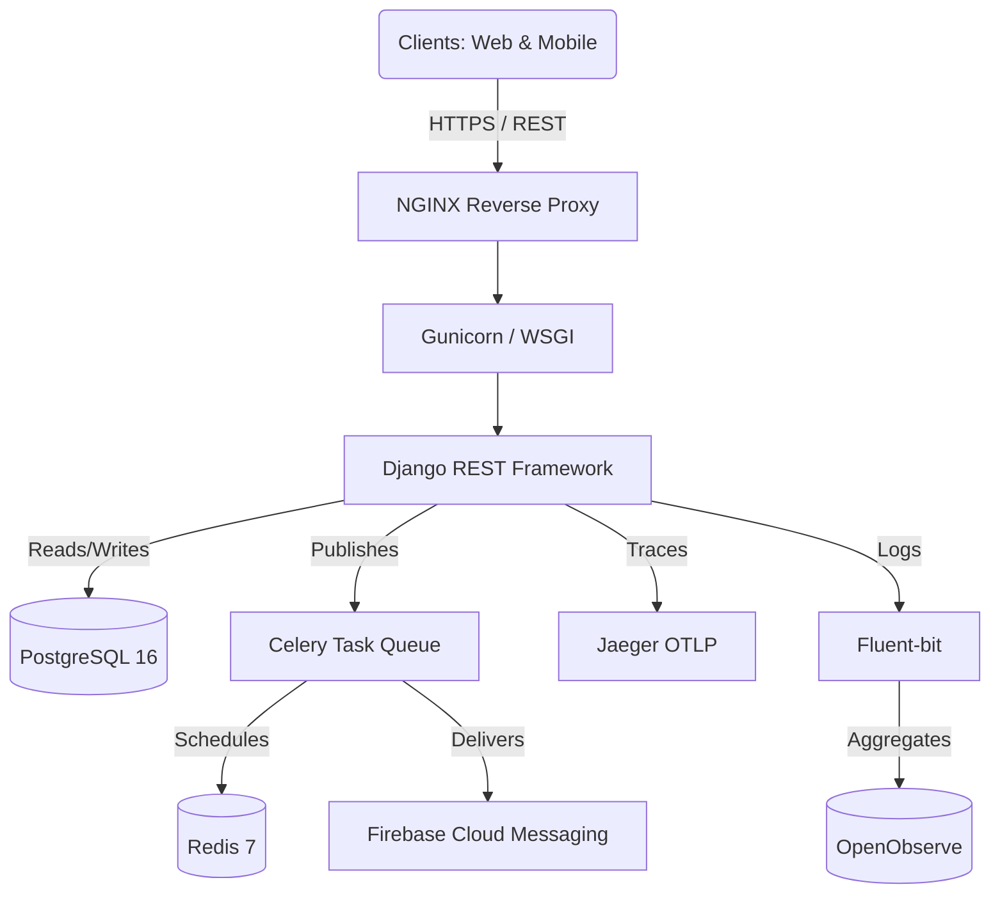

<div align="center">
  

  # UEvent API Gateway & Core Engine
  
  **The Enterprise-Grade Event Management Infrastructure for Modern Universities**

  [](https://www.python.org/)
  [](https://www.djangoproject.com/)
  [](https://www.postgresql.org/)
  [](https://www.docker.com/)
  [](https://opensource.org/licenses/MIT)
  [](#)
  [](#)

  *Proudly engineered for the **University of Transport and Communications (UTC2)***
</div>

---

## 📖 Table of Contents

- [About The Project](#-about-the-project)
- [System Architecture](#-system-architecture)
- [Core Features](#-core-features)
- [Project Structure](#-project-structure)
- [Environment Variables](#-environment-variables)
- [Installation & Getting Started](#-installation--getting-started)
- [Usage & API Examples](#-usage--api-examples)
- [Database & State Management](#-database--state-management)
- [Testing & QA](#-testing--qa)
- [Deployment Guide](#-deployment-guide)
- [Roadmap](#-roadmap)
- [Contributing](#-contributing)
- [License & Acknowledgements](#-license--acknowledgements)

---

## 🚀 About The Project

**UEvent Backend** is the central nervous system powering the UEvent Ecosystem. Developed to solve the immense logistical challenges of orchestrating university-wide events, this platform handles tens of thousands of users, dynamic ticketing, complex location hierarchies, and secure access validation.

Unlike traditional CRUD apps, UEvent is designed with a **Feature-First Monolithic Architecture**, allowing us to keep the system manageable while ensuring it is fully "Microservice-ready". It acts as the ultimate truth source for the Next.js Web Admin Portal and the Flutter Mobile Application.

### Why UEvent?
- **Zero Double-Booking**: Guarantees ticket integrity using row-level database locking during concurrent ticket claims.
- **Cryptographic Security**: Eliminates ticket counterfeiting and screenshot sharing with 15-second rotating, digitally signed QR codes.
- **Academic Ecosystem Integration**: Natively maps to university student ID schemas (e.g., UTC2's 10-digit standard) and institutional SSO namespaces.

---

## 🏛 System Architecture

The infrastructure leverages industry-standard tools combined to form a resilient, highly observable stack.



### Technology Stack
| Layer | Technology | Purpose |
|-------|------------|---------|
| **Core Framework** | Django 6.0.3, DRF | Robust ORM, built-in admin, and rapid REST API generation. |
| **Database** | PostgreSQL 16 | Relational integrity paired with JSONB fields for highly dynamic event registration forms. |
| **Message Broker** | Redis 7 & Celery | Handles asynchronous tasks like bulk email sending, FCM push notifications, and daily cron jobs. |
| **Observability** | Jaeger & OpenObserve | End-to-end distributed tracing (OpenTelemetry) and structured log aggregation via Fluent-bit. |

---

## ✨ Core Features

### 1. Advanced Ticket Provisioning & QR Security
- **Anti-Screenshot Engine**: Generates temporary QR tokens valid for only 15 seconds.
- **Cryptographic Signatures**: Scanners verify the ECDSA signature of the ticket before querying the database, eliminating 99% of fraudulent loads.

### 2. Deep Role-Based Access Control (RBAC)
- Hierarchical permissions mapping system users to specific Event roles (Owner, Co-host, Scanner, Staff).
- Custom middleware enforcing role boundaries across all API endpoints.

### 3. Dynamic Registration Workflows
- **JSONB Schemas**: Organizers can build complex registration questionnaires (Text, Multiple Choice, Dropdowns).
- Answers are efficiently stored and indexed within PostgreSQL's JSONB columns.

### 4. Interactive Engagement Modules
- Event Q&A and post-event feedback systems.
- Robust moderation panel allowing administrators to approve, hide, flag, or escalate submitted content.

---

## 📂 Project Structure

```bash
UEvent-Backend/
├── apps/                    # Feature-based Django Applications
│   ├── events/              # Event lifecycle, categories, organizers
│   ├── interactions/        # Q&A, feedbacks
│   ├── locations/           # Campus, Building, Room capacity models
│   ├── moderation/          # Polymorphic audit trails and moderation logs
│   ├── notifications/       # FCM and Email delivery mechanisms
│   ├── registrations/       # Ticketing, QR logic, custom forms
│   ├── support/             # Helpdesk ticketing system
│   ├── system_admin/        # High-level system overrides
│   └── users/               # Custom User models, RBAC, Sessions
├── common/                  # Shared Utilities
│   ├── models.py            # BaseModel with UUID & Soft Delete
│   ├── permissions.py       # DRF Permission classes
│   └── exceptions.py        # Global exception handler
├── core/                    # Django Configuration (settings, wsgi, asgi)
├── docker-compose.yaml      # Production-ready container orchestration
└── manage.py                # Django CLI
```

---

## ⚙️ Environment Variables

Copy `.env.example` to `.env` and configure the following parameters:

| Variable | Description | Default | Required |
|----------|-------------|---------|----------|
| `DEBUG` | Enables Django debug mode | `True` | Yes |
| `SECRET_KEY` | Cryptographic secret for Django sessions | - | Yes |
| `POSTGRES_DB` | Name of the PostgreSQL database | `uevent_db` | Yes |
| `POSTGRES_USER` | Database username | `postgres` | Yes |
| `POSTGRES_PASSWORD`| Database password | `postgres` | Yes |
| `CELERY_BROKER_URL`| Redis broker connection string | `redis://localhost:6379/0`| Yes |
| `FCM_ENABLED` | Toggle Firebase Push Notifications | `false` | No |
| `OTEL_ENABLED` | Enable OpenTelemetry Exporting | `false` | No |

---

## 💻 Installation & Getting Started

### Method 1: Docker Compose (Recommended for Local Dev)

The entire infrastructure can be brought up with a single command.

```bash
# 1. Clone the repository
git clone https://github.com/TriNguyenThanh/UEvent-backend-Django.git
cd UEvent-backend-Django

# 2. Configure Environment
cp .env.example .env

# 3. Boot up the cluster
docker-compose up -d --build

# 4. Run Migrations & Seed Data
docker-compose exec app python manage.py migrate
docker-compose exec app python manage.py loaddata seed_data.json

# 5. Create Superuser (Optional)
docker-compose exec app python manage.py createsuperuser
```

### Method 2: Bare-metal (For Custom Configurations)

```bash
# 1. Create a virtual environment
python -m venv venv
source venv/bin/activate  # On Windows: venv\Scripts\activate

# 2. Install dependencies
pip install -r requirements.txt

# 3. Setup Postgres & Redis manually, update .env accordingly

# 4. Migrate and Run
python manage.py migrate
python manage.py runserver
```

---

## 🔌 Usage & API Examples

Once running, the API is accessible at `http://localhost:8000/api/v1/`.

### Interactive API Documentation
UEvent implements fully compliant OpenAPI schemas. You can test endpoints directly via the browser:
- **Swagger UI**: `http://localhost:8000/api/v1/swagger/`
- **ReDoc**: `http://localhost:8000/api/v1/redoc/`

### Example cURL Request (User Authentication)
```bash
curl -X POST http://localhost:8000/api/v1/users/auth/login/ \
  -H "Content-Type: application/json" \
  -d '{
    "username": "5651071902",
    "password": "SecurePassword123"
  }'
```

---

## 🗄 Database & State Management

### The Soft Delete Pattern
Data is never truly deleted. We use a logical deletion strategy:
- `BaseModel.delete()` sets `deleted_at = timezone.now()`.
- The default manager (`objects`) filters out deleted items automatically.
- To access everything (including deleted items), use `all_objects`.

### Avoiding Integer Enumeration
All models use `UUIDv4` for primary keys to prevent ID scraping (e.g., sequentially requesting `/api/v1/users/1`, `/api/v1/users/2`).

---

## 🧪 Testing & QA

Our CI/CD pipeline runs these tests automatically. To run them locally:

```bash
# Run the complete test suite
python manage.py test

# Run tests for a specific app
python manage.py test apps.registrations
```

> **Note**: We utilize strict testing methodologies for any code touching the `CheckInLog` and `Ticket` models to prevent race conditions.

---

## 📦 Deployment Guide

UEvent is built for containerized deployment. For production:
1. Set `DEBUG=False` in your production environment.
2. Bind Gunicorn to the application port instead of the Django dev server.
3. Ensure NGINX is configured to serve static files (`STATIC_ROOT`) and media.
4. Mount the `firebase-service-account.json` strictly as a secure Docker secret.

---

## 🛤 Roadmap

- [ ] **Phase 1**: Core Event Lifecycle & Ticketing (Completed)
- [ ] **Phase 2**: Asynchronous Push Notifications & Celery Workers (Completed)
- [ ] **Phase 3**: Distributed Tracing & Telemetry (Completed)
- [ ] **Phase 4**: OAuth2 Provider Integration & Passkeys (In Progress)
- [ ] **Phase 5**: Payment Gateway Integrations (VNPay / MoMo)

---

## 🤝 Contributing

We welcome contributions! Please follow these steps to contribute:
1. Fork the Project.
2. Create your Feature Branch (`git checkout -b feature/AmazingFeature`).
3. Follow the GitNexus protocol (run `npx gitnexus analyze` locally before making structural changes).
4. Commit your Changes (`git commit -m 'Add some AmazingFeature'`).
5. Push to the Branch (`git push origin feature/AmazingFeature`).
6. Open a Pull Request.

---

## 📜 License & Acknowledgements

Distributed under the MIT License. See `LICENSE` for more information.

*A special thanks to the faculty and student body of UTC2 for providing the operational requirements that inspired this platform.*
