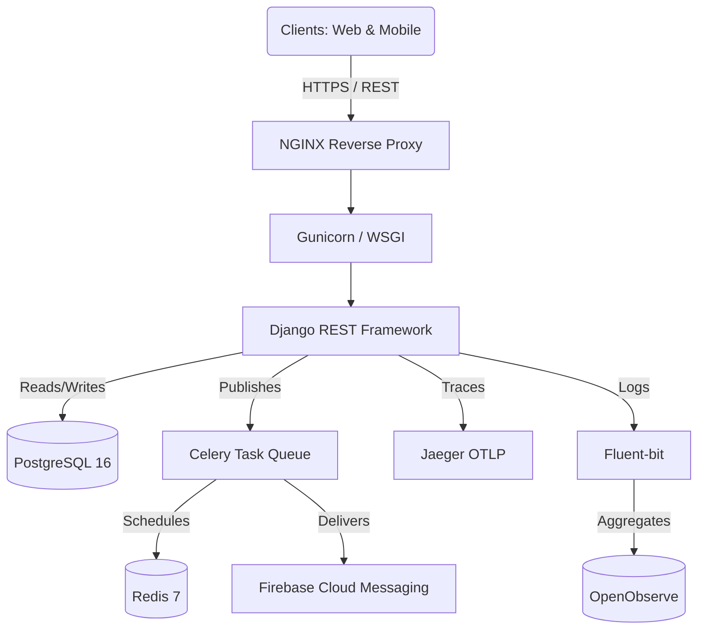

<div align="center">
  

  # UEvent API Gateway & Core Engine (Tiếng Việt)
  
  **Hạ Tầng Quản Lý Sự Kiện Chuẩn Doanh Nghiệp Dành Cho Khối Đại Học**

  [](https://www.python.org/)
  [](https://www.djangoproject.com/)
  [](https://www.postgresql.org/)
  [](https://www.docker.com/)
  [](https://opensource.org/licenses/MIT)
  [](#)
  [](#)

  *Được nghiên cứu và phát triển riêng cho **Phân hiệu Trường Đại học Giao thông Vận tải tại TP.HCM (UTC2)***
</div>

---

## 📖 Mục Lục

- [Giới Thiệu Dự Án](#-giới-thiệu-dự-án)
- [Repository Liên Quan](#-repository-liên-quan)
- [Kiến Trúc Hệ Thống](#-kiến-trúc-hệ-thống)
- [Tính Năng Cốt Lõi](#-tính-năng-cốt-lõi)
- [Cấu Trúc Mã Nguồn](#-cấu-trúc-mã-nguồn)
- [Cấu Hình Môi Trường](#-cấu-hình-môi-trường)
- [Dependency Cần Cài](#-dependency-cần-cài)
- [Hướng Dẫn Cài Đặt](#-hướng-dẫn-cài-đặt)
- [Cấu Hình Firebase](#-cấu-hình-firebase)
- [Tài Khoản Test & Lưu Ý Bắt Buộc](#-tài-khoản-test--lưu-ý-bắt-buộc)
- [Sử Dụng & API Docs](#-sử-dụng--api-docs)
- [Kiểm Thử (Testing)](#-kiểm-thử-testing)
- [Hướng Dẫn Triển Khai (Deployment)](#-hướng-dẫn-triển-khai-deployment)
- [Lộ Trình Phát Triển](#-lộ-trình-phát-triển)
- [Hướng Dẫn Đóng Góp](#-hướng-dẫn-đóng-góp)
- [Bản Quyền & Lời Cảm Ơn](#-bản-quyền--lời-cảm-ơn)

---

## 🚀 Giới Thiệu Dự Án

**UEvent Backend** là bộ não trung tâm vận hành toàn bộ Hệ sinh thái UEvent. Được thiết kế để giải quyết bài toán phức tạp về hậu cần và quản trị sự kiện quy mô lớn trong môi trường đại học, hệ thống có khả năng xử lý hàng chục ngàn người dùng, quản lý phát hành vé động, kiểm soát phân cấp không gian và xác thực bảo mật đa tầng.

Hệ thống được thiết kế theo mô hình **Feature-First Monolithic Architecture**, đảm bảo code được chia module hóa cực cao (chuẩn bị sẵn sàng để bóc tách thành Microservices nếu cần trong tương lai).

### Tại Sao Lại Chọn UEvent?
- **Triệt Tiêu Lỗi Trùng Lặp Vé (Zero Double-Booking)**: Cam kết tính toàn vẹn dữ liệu bằng kỹ thuật khóa dòng cấp DB (`select_for_update`) khi có hàng ngàn sinh viên truy cập đăng ký vé cùng lúc.
- **Bảo Mật Vé Mã Hóa Chuẩn Quân Sự**: Loại bỏ hoàn toàn tình trạng chụp màn hình nhượng vé bằng cơ chế mã hóa QR xoay vòng 15 giây và xác thực bằng chữ ký điện tử ECDSA.
- **Tích Hợp Sâu Vào Giáo Dục**: Tương thích hoàn hảo với hệ thống mã số sinh viên 10 chữ số của UTC2 và tên miền định danh `@st.utc2.edu.vn`.

---

## 🔗 Repository Liên Quan

UEvent được tách thành repository backend và frontend riêng để API, admin portal và mobile app có thể vận hành độc lập nhưng vẫn dùng chung contract sản phẩm.

| Repository | Vai trò |
|------------|---------|
| **Backend** | Repository hiện tại: Django REST API, mô hình dữ liệu PostgreSQL, xác thực, gửi FCM và các endpoint quản trị hệ thống. |
| **Frontend** | [UEvent-Frontend](https://github.com/TriNguyenThanh/UEvent-Frontend): Next.js Admin Portal và Flutter Mobile App. |

Khi test end-to-end, hãy chạy backend này trước, sau đó trỏ Web và Mobile của frontend về API base URL của backend.

---

## 🏛 Kiến Trúc Hệ Thống

Cơ sở hạ tầng được xây dựng từ những công nghệ lõi mạnh mẽ nhất trong ngành.



### Bảng Công Nghệ Lõi
| Tầng Công Nghệ | Công Cụ | Mục Đích |
|-------|------------|---------|
| **Core Framework** | Python 3.11, Django 5.1.15, DRF 3.15.2 | ORM mạnh mẽ, trang Admin tích hợp, và khả năng sinh REST API siêu tốc. |
| **Cơ Sở Dữ Liệu** | PostgreSQL 16 | Đảm bảo tính toàn vẹn quan hệ (Relational) kết hợp cùng cột dữ liệu JSONB cho form đăng ký siêu linh hoạt. |
| **Message Broker** | Redis 7 & Celery | Xử lý các tác vụ nặng chạy ngầm (gửi Email hàng loạt, đẩy thông báo FCM, cron jobs). |
| **Trải Nghiệm Hệ Thống** | Jaeger & OpenObserve | Truy vết request phân tán (OpenTelemetry) và gom log tập trung thông qua Fluent-bit. |

---

## ✨ Tính Năng Cốt Lõi

### 1. Cấp Vé Tiên Tiến & Bảo Mật QR Code
- **Engine Chống Chụp Màn Hình**: Thuật toán sinh mã QR tạm thời chỉ có hiệu lực đúng 15 giây.
- **Chữ Ký Số**: Máy quét tại cổng sự kiện sẽ xác thực chữ ký của vé trước khi gọi API tới máy chủ, loại bỏ 99% các request giả mạo/DDOS.

### 2. Phân Quyền Sâu (RBAC)
- Phân quyền theo cấp bậc với từng sự kiện (Chủ sở hữu, Đồng tổ chức, Người soát vé, Nhân viên).
- Middleware tùy chỉnh kiểm soát chặt chẽ quyền hạn trên từng API endpoint.

### 3. Quy Trình Đăng Ký Động
- **JSONB Schemas**: Ban tổ chức tự do xây dựng các form khảo sát/đăng ký phức tạp (Trắc nghiệm, Điền chữ, Dropdown).
- Câu trả lời được lưu và lập chỉ mục (index) với tốc độ truy vấn cực cao nhờ sức mạnh của PostgreSQL JSONB.

### 4. Góc Tương Tác Sự Kiện
- Xử lý mượt mà các phiên Hỏi Đáp (Q&A) và đánh giá sau sự kiện.
- Bảng điều khiển kiểm duyệt chuyên sâu cho phép admin duyệt, ẩn, cảnh báo hoặc đánh dấu các nội dung vi phạm.

---

## 📂 Cấu Trúc Mã Nguồn

```bash
UEvent-Backend/
├── apps/                    # Các module tính năng cốt lõi (Feature-based)
│   ├── events/              # Vòng đời sự kiện, danh mục, ban tổ chức
│   ├── interactions/        # Q&A, Feedback
│   ├── locations/           # Quản lý Sức chứa Cơ sở, Tòa nhà, Phòng học
│   ├── moderation/          # Log kiểm duyệt nội dung đa hình (Polymorphic)
│   ├── notifications/       # Module đẩy thông báo Email & FCM
│   ├── registrations/       # Phát hành vé, Check-in, Biểu mẫu đăng ký
│   ├── support/             # Hệ thống quản lý Ticket hỗ trợ kỹ thuật
│   ├── system_admin/        # Tùy chỉnh Admin cấp cao
│   └── users/               # Quản lý User tùy chỉnh, RBAC, Sessions
├── common/                  # Tiện ích dùng chung
│   ├── models.py            # BaseModel tích hợp UUID & Xóa Mềm (Soft Delete)
│   ├── permissions.py       # Phân quyền DRF Permissions
│   └── exceptions.py        # Quản lý ngoại lệ (Exception) toàn hệ thống
├── core/                    # Cấu hình gốc (settings, wsgi, asgi)
├── docker-compose.yaml      # File khởi động hạ tầng Docker
└── manage.py                # Django CLI
```

---

## ⚙️ Cấu Hình Môi Trường (.env)

Sao chép `.env.example` thành `.env` tại thư mục gốc repository và điều chỉnh các thông số bắt buộc. File example được commit chỉ chứa placeholder; không dán secret production vào file này.

### Vị Trí Đặt File Cấu Hình

| File | Đặt / chỉnh tại | Mục đích |
|------|-----------------|----------|
| File mẫu môi trường | `.env.example` | Template placeholder an toàn cho cài đặt local. Commit file này. |
| File môi trường local | `.env` | Giá trị thật cho Django, PostgreSQL, Redis, Keycloak, Firebase, email và observability. Không commit file này. |
| File môi trường production | `.env.production` | Giá trị production/deployment nếu quy trình triển khai dùng file. Giữ riêng tư và không commit lên Git. |
| Firebase Admin service account | `firebase-service-account.json` | Credential Firebase Admin SDK tải từ Firebase Console. Đặt ở thư mục gốc backend khi dùng Docker Compose. |
| Placeholder Firebase Admin | `firebase-service-account.example.json` | File placeholder/mẫu an toàn. Không dùng như credential thật. |
| Mount path service account trong Docker | `/run/firebase-service-account.json` trong container `app` và `celery-worker` | Đường dẫn container dùng bởi `FIREBASE_CREDENTIALS_PATH` khi chạy Docker Compose. |
| File đọc cấu hình Django | `core/settings.py` | Đọc giá trị `.env` bằng `django-environ`; chỉ chỉnh khi cần thêm setting mới. |

| Biến Số | Chức Năng | Mặc Định | Bắt Buộc |
|----------|-------------|---------|----------|
| `DEBUG` | Chế độ gỡ lỗi | `True` | Có |
| `SECRET_KEY` | Mã bảo mật cốt lõi để mã hóa phiên bản Django | - | Có |
| `POSTGRES_DB` | Tên Database PostgreSQL | `uevent_db` | Có |
| `POSTGRES_USER` | Tên đăng nhập Database | `postgres` | Có |
| `POSTGRES_PASSWORD`| Mật khẩu Database | `postgres` | Có |
| `HOST` | Host PostgreSQL (`db` khi dùng Docker Compose, `localhost` khi chạy trực tiếp) | `db` | Có |
| `PORT` | Port PostgreSQL (`5432` trong Docker network, thường là `5432` khi chạy local) | `5432` | Có |
| `REDIS_URL` | Redis URL cho Django cache | `redis://redis:6379/0` | Không |
| `CELERY_BROKER_URL`| Chuỗi kết nối đến Redis | `redis://localhost:6379/0`| Có |
| `CELERY_RESULT_BACKEND` | Redis result backend | `redis://localhost:6379/1` | Có |
| `FCM_ENABLED` | Bật/tắt thông báo đẩy Firebase | `false` | Không |
| `FIREBASE_CREDENTIALS_PATH` | Đường dẫn tới Firebase Admin service account JSON | - | Bắt buộc khi `FCM_ENABLED=true` |
| `FIREBASE_CREDENTIALS_JSON` | Nội dung Firebase Admin service account JSON dạng inline | - | Có thể dùng thay file |
| `GOOGLE_OAUTH_CLIENT_IDS` | Danh sách Google OAuth client ID backend chấp nhận | - | Bắt buộc cho Google Sign-In |

Baseline `.env` local tối thiểu, đồng bộ với `.env.example`:

```env
DEBUG=True
SECRET_KEY=change-me-local-only
TICKET_QR_SECRET=change-me-local-ticket-secret
ALLOWED_HOSTS=localhost,127.0.0.1,0.0.0.0
CORS_ALLOWED_ORIGINS=http://localhost:3000,http://127.0.0.1:3000

POSTGRES_DB=uevent_db
POSTGRES_USER=postgres
POSTGRES_PASSWORD=postgres
HOST=db
PORT=5432

REDIS_URL=redis://redis:6379/0
CELERY_BROKER_URL=redis://redis:6379/0
CELERY_RESULT_BACKEND=redis://redis:6379/1

FCM_ENABLED=false
FIREBASE_CREDENTIALS_PATH=/run/firebase-service-account.json
GOOGLE_OAUTH_CLIENT_IDS=
PUBLIC_WEB_BASE_URL=http://localhost:3000
```

Nếu chạy trực tiếp không qua Docker, đổi `HOST=localhost`, `PORT=5432`, `REDIS_URL=redis://localhost:6379/0`, `CELERY_BROKER_URL=redis://localhost:6379/0`, và `CELERY_RESULT_BACKEND=redis://localhost:6379/1`.

---

## 📦 Dependency Cần Cài

Cài toàn bộ package Python trong `requirements.txt`. Các dependency lõi gồm:

- `django`, `djangorestframework`, `django-filter`, `django-environ`, `drf-yasg`
- `psycopg2-binary` để kết nối PostgreSQL
- `celery`, `redis`, `django-redis` cho job bất đồng bộ và cache
- `firebase-admin`, `google-auth` cho FCM và Google token flow
- `PyJWT`, `cryptography`, `webauthn==2.7.1` cho xác thực, ký QR và passkey
- `opentelemetry-*`, `python-json-logger` cho tracing và log dạng cấu trúc
- `boto3`, `openpyxl`, `requests`, `cachetools` cho tích hợp và export dữ liệu

---

## 💻 Hướng Dẫn Cài Đặt

### Cách 1: Sử Dụng Docker Compose (Khuyên dùng)

Cách dễ nhất để dựng toàn bộ hệ thống khổng lồ này chỉ bằng vài dòng lệnh.

```bash
# 1. Clone mã nguồn
git clone https://github.com/TriNguyenThanh/UEvent-Backend.git
cd UEvent-Backend

# 2. Chuẩn bị file môi trường
cp .env.example .env
# Sau đó chỉnh secret/host trong .env theo môi trường chạy.

# 3. Chạy toàn bộ cluster (Postgres, Redis, Celery, App, Jaeger)
docker-compose up -d --build

# 4. Migrate CSDL và nạp dữ liệu mẫu
docker-compose exec app python manage.py migrate
docker-compose exec app python manage.py seed_data --reset
```

### Cách 2: Cài Đặt Trực Tiếp (Bare-metal)

```bash
# 1. Tạo môi trường ảo (Virtual Env)
python -m venv venv
source venv/bin/activate  # Trên Windows: venv\Scripts\activate

# 2. Cài đặt thư viện
pip install -r requirements.txt

# 3. Tự cài đặt Postgres & Redis trên máy, sau đó cập nhật .env

# 4. Migrate và khởi động
python manage.py migrate
python manage.py runserver
```

---

## 🔥 Cấu Hình Firebase

Backend dùng Firebase Admin SDK để gửi thông báo FCM. Phần này tách biệt với file Firebase client của frontend (`google-services.json` và `GoogleService-Info.plist`).

File Firebase backend cần có:

- `firebase-service-account.json`: service account JSON của Firebase Admin SDK.
- `firebase-service-account.example.json`: file placeholder/mẫu, không dùng như credential thật.

### Tạo Cấu Hình Firebase Admin SDK

Tạo file service account cho backend từ Firebase Console khi cần bật gửi FCM thật:

1. Mở Firebase Console và chọn cùng Firebase project đang dùng cho mobile app.
2. Vào **Project settings** > **Service accounts**.
3. Chọn **Firebase Admin SDK**.
4. Bấm **Generate new private key**.
5. Xác nhận tải xuống. Firebase sẽ tải một file JSON private key.
6. Đổi tên file vừa tải thành `firebase-service-account.json`.
7. Đặt file tại thư mục gốc backend: `UEvent-Backend/firebase-service-account.json`.
8. Khi dùng Docker Compose, đặt `FCM_ENABLED=true` và `FIREBASE_CREDENTIALS_PATH=/run/firebase-service-account.json`.
9. Khi chạy trực tiếp không qua Docker, đặt `FIREBASE_CREDENTIALS_PATH` thành đường dẫn tuyệt đối hoặc tương đối tới file JSON, ví dụ `firebase-service-account.json`.

Docker Compose đã mount service account vào container app và worker:

```yaml
./firebase-service-account.json:/run/firebase-service-account.json:ro
```

Bật gửi Firebase bằng cấu hình:

```env
FCM_ENABLED=true
FIREBASE_CREDENTIALS_PATH=/run/firebase-service-account.json
```

Nếu môi trường không hỗ trợ mount file, có thể truyền nội dung JSON qua `FIREBASE_CREDENTIALS_JSON`.

Lưu ý bảo mật:

- Không commit Firebase service account thật lên public repository.
- Rotate service account nếu credential từng bị lộ.
- Mobile Android phải dùng đúng `google-services.json` cùng Firebase project; iOS phải dùng đúng `GoogleService-Info.plist` khi bật target iOS.
- Frontend repository có hướng dẫn tạo file Firebase client và Android SHA fingerprint: [UEvent-Frontend](https://github.com/TriNguyenThanh/UEvent-Frontend).

---

## 🧪 Tài Khoản Test & Lưu Ý Bắt Buộc

Fixture seed tại `Docs/database/data_seed.json` tạo các user mẫu như `sysadmin`, `organizer`, `student01`, `student02`, nhưng trường password trong fixture đang để rỗng. Vì vậy các user này phục vụ dữ liệu quan hệ/demo, không phải tài khoản đăng nhập sẵn.

Để test thủ công local, tạo tài khoản dùng được bằng lệnh:

```bash
docker-compose exec app python manage.py createsuperuser
```

hoặc khi chạy trực tiếp:

```bash
python manage.py createsuperuser
```

Các lưu ý để project hoạt động đúng:

- Khởi động PostgreSQL và Redis trước khi chạy Django nếu không dùng Docker.
- Khởi động Celery worker khi test thông báo hẹn lịch hoặc push delivery: `celery -A core worker --loglevel=INFO`.
- Cấu hình Keycloak / Google OAuth trước khi test luồng xác thực production.
- Cấu hình `CORS_ALLOWED_ORIGINS` chứa URL frontend, thường là `http://localhost:3000`.
- Không commit `.env`, secret production và `firebase-service-account.json` vào Git.

---

## 🔌 Sử Dụng & API Docs

Khi hệ thống khởi chạy, API sẽ hoạt động tại `http://localhost:8000/api/v1/`.

### Giao Diện Tài Liệu API
Hệ thống tuân thủ nghiêm ngặt tiêu chuẩn OpenAPI. Bạn có thể test trực tiếp trên trình duyệt:
- **Swagger UI**: `http://localhost:8000/swagger/`
- **ReDoc**: `http://localhost:8000/redoc/`

### Ví dụ Lệnh cURL (Đăng Nhập)
```bash
curl -X POST http://localhost:8000/api/v1/admin/auth/login/ \
  -H "Content-Type: application/json" \
  -d '{
    "username": "5651071902",
    "password": "MatKhauSieuKho123"
  }'
```

---

## 🗄 Quản Lý Cơ Sở Dữ Liệu

### Thuật Toán Xóa Mềm (Soft Delete)
Dữ liệu trong UEvent KHÔNG BAO GIỜ bị xóa vĩnh viễn:
- Lệnh `BaseModel.delete()` chỉ cập nhật cột `deleted_at = timezone.now()`.
- Lệnh query thông thường (`objects`) sẽ tự động ẩn các bản ghi đã xóa.
- Để xem lịch sử và các bản ghi bị xóa, lập trình viên sử dụng manager `all_objects`.

### Chống Quét ID
Toàn bộ khóa chính (PK) dùng `UUIDv4`, giúp ngăn chặn việc hacker dùng bot quét thứ tự tuần tự ID người dùng hoặc ID sự kiện.

---

## 🧪 Kiểm Thử (Testing)

Hệ thống có bộ Test Suite hoàn chỉnh. Chạy test trên môi trường Local:

```bash
# Chạy toàn bộ Test
python manage.py test

# Chỉ chạy test cho module Phát hành vé (Rất quan trọng)
python manage.py test apps.registrations
```

---

## 📦 Hướng Dẫn Triển Khai (Deployment)

1. Đặt `DEBUG=False` trong file `.env` thật.
2. Dùng `Gunicorn` làm server thay vì lệnh `runserver` mặc định của Django.
3. Cấu hình NGINX để làm Reverse Proxy và phục vụ các file Static/Media.
4. Bảo mật tuyệt đối file `firebase-service-account.json`, sử dụng Docker Secret.

---

## 🛤 Lộ Trình Phát Triển

- [x] **Giai đoạn 1**: Hoàn thiện lõi Sự kiện & Đăng ký vé.
- [x] **Giai đoạn 2**: Đẩy thông báo ngầm với Celery Workers.
- [x] **Giai đoạn 3**: Giám sát hệ thống với OpenTelemetry.
- [x] **Giai đoạn 4**: Tích hợp Passkeys (WebAuthn) và OAuth2.

---

## 🤝 Hướng Dẫn Đóng Góp

1. Fork dự án.
2. Tạo nhánh tính năng (`git checkout -b feature/TinhNangMoi`).
3. Chạy `npx gitnexus analyze` để xem xét mức độ ảnh hưởng của đoạn code bạn vừa thay đổi.
4. Commit code (`git commit -m 'Thêm TinhNangMoi'`).
5. Push nhánh (`git push origin feature/TinhNangMoi`).
6. Mở Pull Request.

---

## 📜 Bản Quyền & Lời Cảm Ơn

Được phân phối dưới giấy phép MIT License. Xem file `LICENSE` để biết thêm chi tiết.

*Xin gửi lời cảm ơn đặc biệt đến sinh viên và giảng viên Phân hiệu Đại học Giao thông Vận tải (UTC2) đã cung cấp góc nhìn thực tiễn về quy trình tổ chức sự kiện để dự án này được ra đời.*
