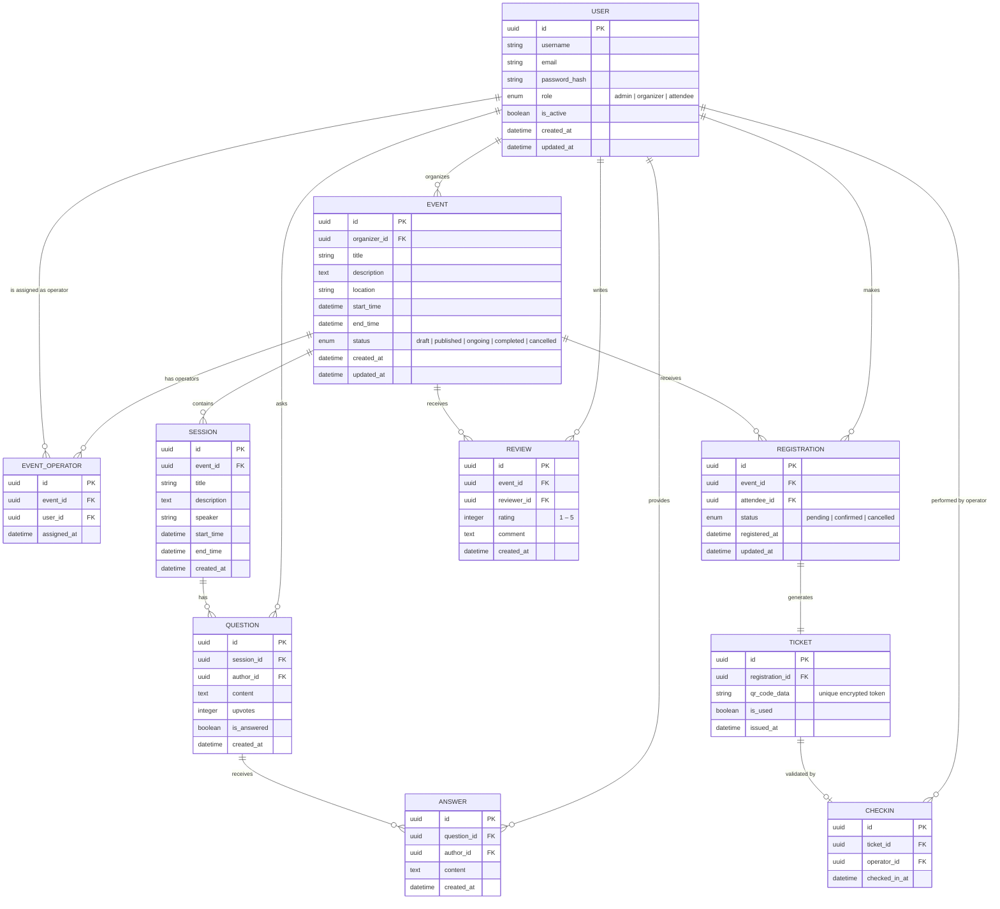

# UEvent Database – Entity Relationship Diagram

> All entities are derived from the system description in `README.md`.

---

## Entity Descriptions

| Entity | Description |
|---|---|
| **USER** | Platform account. The `role` field (`admin`, `organizer`, `attendee`) governs system-wide permissions. Per-event operator rights are managed separately via `EVENT_OPERATOR`. |
| **EVENT** | The central aggregate. Created by an organizer and progressed through a lifecycle (`draft → published → ongoing → completed`). |
| **EVENT_OPERATOR** | Join table granting a `USER` operator privileges on a specific `EVENT` (e.g. running check-in desks). |
| **SESSION** | A timed sub-unit within an `EVENT` (e.g. a talk or workshop). Hosts Q&A interactions. |
| **REGISTRATION** | An attendee's booking record for an event. A confirmed registration triggers ticket issuance. |
| **TICKET** | Holds a unique, encrypted `qr_code_data` token used for physical entry validation. |
| **CHECKIN** | Immutable audit record created when an operator scans and validates a `TICKET`. |
| **QUESTION** | A question submitted by an attendee inside a `SESSION`. Can be upvoted by peers. |
| **ANSWER** | A response to a `QUESTION`, posted by an organizer, operator, or speaker. |
| **REVIEW** | Post-event feedback submitted by an attendee, including a numeric `rating` (1–5) and optional comment. |
